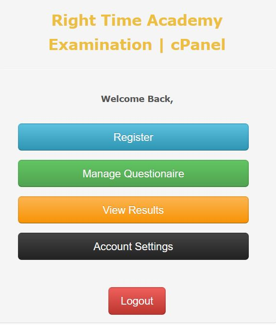
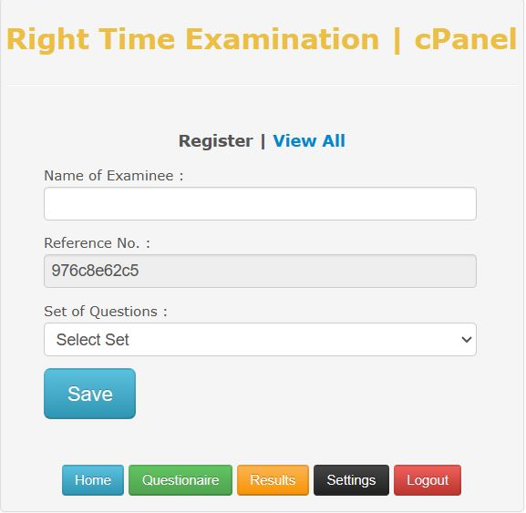
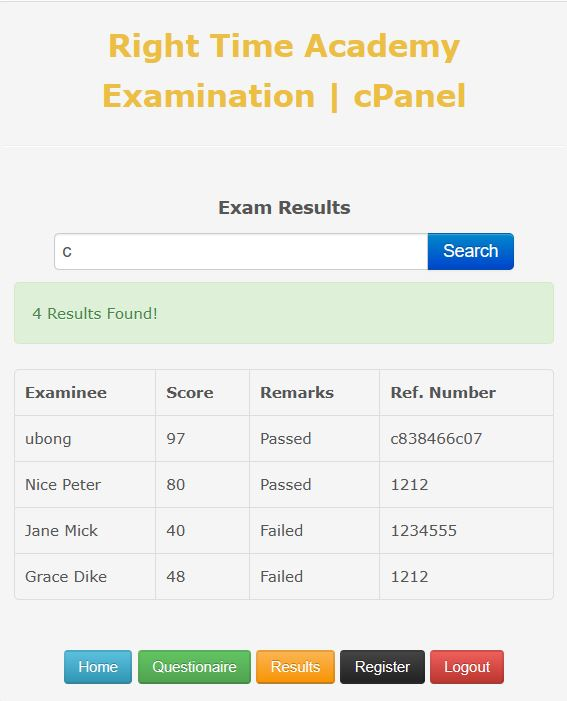
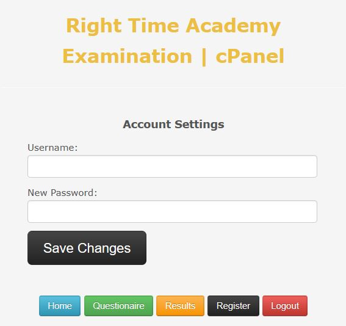
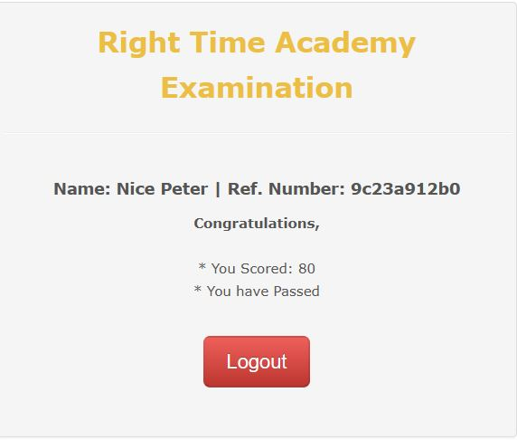

- Dashboard.

 # Name CBT
# Author: Nancy Idiong
# URLs:
# https://github.com/Nancyiddy/cbt
# https://twitter.com/nancy_iddy
# Discription

CBT (COMPUTER BASED TEST) system is a software solution  to
drastically simplify the evaluation process for Right Time Academy and other schools, universities,
recruiting firms as well as private and public companies, allowing
professors, teachers and examiners to create, distribute and manage exams,
tests, surveys and quizzes.

- Registration

- Login

- Question Set

- Result

- Update.

- Success.

Compared to the traditional Pen-and-Paper Testing (PPT), CBT simplifies
the whole process of evaluation reducing costs and improving quality and
reliability of the examinations.

CBT comes in a variety of languages and is already used all over the
world by top universities, schools, private and public institutions,
independent educators and research centers.

### KEY FEATURES

* **Flexibility and Configurability**: The system has been designed to offer a
high degree of adaptability to cover a great variety of usage scenarios.
Numerous configuration features allow customizing CBT to fit all possible
requirements.

* **Web-based Architecture**: CBT is Web-based and developed with Apache, MySQL, PHP technology.
User-friendly interface allows you to install and use CBT by simply connecting one cable to the switch of
your computer networks. All the computers on the network will be able to use
TCExam independently from the client’s operating system as a normal intranet
website, with no need to install any additional software or plug-in.

* **Results and Statistics**: CBT outputs a variety of result pages, enabling
various selection filters and providing numerous statistical indexes.
Results and statistics can then be exported into various formats for filing
or reworking. The test-takers can immediately get the result oftheir test.

* **Multimedia Content**: CBT uses a common mark-up language to add text
formatting and images.

* **Unique Tests**: CBT can simultaneously generate unique tests for
different users by randomly selecting and sorting questions and alternative
answers. This feature drastically reduces or eliminates the chances of
cheating on the test.

* **Paper Testing with Optical Character Recognition (OMR)**: CBT can
generate printable PDF documents for pen-and-paper testing. The OMR answer
sheet can be scanned and uploaded to CBT for automatic test importing,
scoring and reporting.

* **Security**: CBT is more secure than traditional Pen-and-Paper testing.
It supports SSL (Secure Socket Layer) encryption and includes various
authentication levels to discriminate the access to the various sections
(user/password, access level, group, IP address). Test time, test activity,
results, and statistics: every part of the test is managed and stored in the
server, leaving no sensitive data in the users’ client computers.
